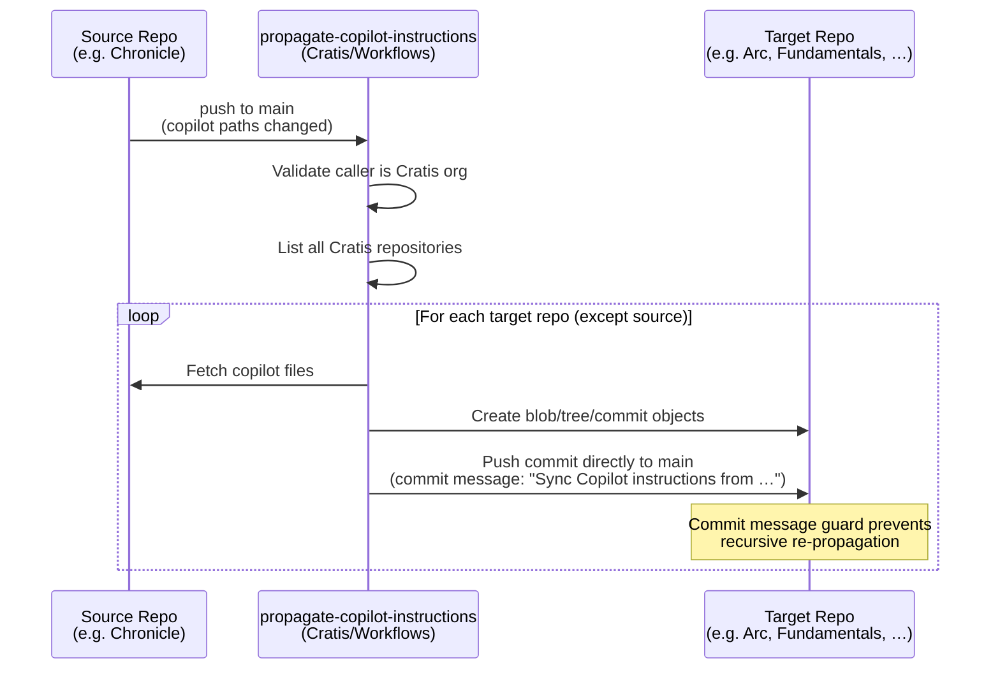
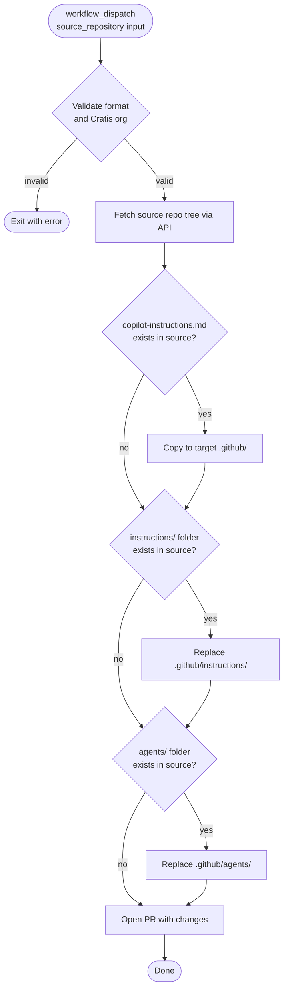

# Workflows

> [!IMPORTANT]
> This repository is for use by the **[Cratis](https://github.com/Cratis) organization only**. The reusable workflows here are designed specifically for the Cratis GitHub organization and include runtime validation that rejects calls from outside it.

Common reusable GitHub Actions workflows for Cratis repositories.

## Getting started with your Cratis repository

To connect a Cratis repository to the shared Copilot synchronization system, add two thin wrapper workflows to your repository. The easiest way is to trigger the [Bootstrap Copilot Sync](#bootstrap-copilot-sync-one-time-setup) workflow once — it will open a PR in every Cratis repository automatically.

If you prefer to add the workflows manually, create the following two files:

**`.github/workflows/sync-copilot-instructions.yml`**

```yaml
name: Sync Copilot Instructions

on:
  workflow_dispatch:
    inputs:
      source_repository:
        description: 'Source repository (owner/repo format)'
        required: true
        type: string

jobs:
  sync:
    uses: Cratis/Workflows/.github/workflows/sync-copilot-instructions.yml@main
    with:
      source_repository: ${{ inputs.source_repository }}
    secrets: inherit
```

**`.github/workflows/propagate-copilot-instructions.yml`**

```yaml
name: Propagate Copilot Instructions

on:
  push:
    branches: ["main"]
    paths:
      - ".ai/**"
      - ".claude/**"
      - ".github/copilot-instructions.md"
      - ".github/instructions/**"
      - ".github/agents/**"
      - ".github/skills/**"
      - ".github/prompts/**"
      - ".github/hooks/**"
  workflow_dispatch:

jobs:
  propagate:
    uses: Cratis/Workflows/.github/workflows/propagate-copilot-instructions.yml@main
    with:
      event_name: ${{ github.event_name }}
    secrets: inherit
```

Both wrapper workflows require the `PAT_WORKFLOWS` secret to be set in the repository or inherited from the organization.

| PAT type | Required permissions |
|---|---|
| Classic PAT | `repo` scope (full repository access) |
| Fine-grained PAT | **Contents** (read/write) + **Metadata** (read) |

> [!IMPORTANT]
> The propagation workflow pushes directly to the default branch of each target repository. The GitHub user account that owns `PAT_WORKFLOWS` must therefore be configured as a **bypass actor** on every target repository's branch protection ruleset. See [Branch protection setup](#branch-protection-setup) below for the exact steps.

---

## Cleaning up PR artifacts

When a repository publishes Docker images or NuGet packages during pull requests (for example, pre-release builds tagged with the PR number), those packages should be removed once the pull request is closed to avoid accumulating stale artifacts.

### Automatic setup (recommended)

The easiest way is to trigger the [Bootstrap Cleanup PR Artifacts](#bootstrap-cleanup-pr-artifacts) workflow once — it will open a PR in every Cratis repository automatically, adding the wrapper workflow shown below.

### Manual setup

If you prefer to add the wrapper manually, create the following file in your repository:

**`.github/workflows/cleanup-pr-artifacts.yml`**

```yaml
name: Cleanup PR Artifacts

on:
  pull_request:
    types: [closed]

jobs:
  cleanup:
    uses: Cratis/Workflows/.github/workflows/cleanup-pr-artifacts.yml@main
    with:
      pull_request: ${{ github.event.pull_request.number }}
    secrets: inherit
```

The workflow assumes packages are tagged or versioned using the PR number:

| Package type | Expected pattern | Example |
|---|---|---|
| Container image (Docker) | tag contains `pr{number}` | `pr42` |
| NuGet package | version contains `pr{number}` | `1.0.0-pr42.1` |

Only packages linked to the calling repository are considered, so the cleanup is always scoped to the repository that called the workflow.

**Secrets required:** `PAT_WORKFLOWS` — classic PAT with `read:packages` + `delete:packages` scopes, or fine-grained PAT with **Packages** read/write

---

## How it works

### Copilot instruction synchronization

Copilot artifacts are kept in one authoritative repository and automatically propagated to all other Cratis repositories whenever they change.

The artifacts that are synchronized are:

| Path | Description |
|---|---|
| `.github/copilot-instructions.md` | Root Copilot instructions file |
| `.github/instructions/` | Folder of scoped instruction files |
| `.github/agents/` | Folder of custom agent definitions |
| `.github/skills/` | Folder of skill files |
| `.github/prompts/` | Folder of prompt files |
| `.github/hooks/` | Folder of hook files |

### Excluding files from synchronization

If a repository contains Copilot artifacts that are specific to that repository and should **not** be synced to other repos, create a `.github/.copilot-sync-ignore` file in the source repository. It works like a `.gitignore` — list one glob pattern per line.

```text
# Skills that are specific to this repository
skills/repo-specific-skill.md

# A whole subfolder of instructions
instructions/local-only/

# Wildcard examples
skills/experimental-*
prompts/draft-?.md
```

**Rules:**

| Feature | Syntax |
|---|---|
| Comment | Lines starting with `#` |
| Single-segment wildcard | `*` — matches any characters except `/` |
| Multi-segment wildcard | `**` — matches across directory boundaries |
| Single-character wildcard | `?` — matches exactly one character |
| `.github/` prefix | Optional — `skills/foo.md` and `.github/skills/foo.md` are equivalent |

When the `.copilot-sync-ignore` file is present in the source repository, any matching Copilot files are excluded before the changes are pushed to the target repository.

### Propagation flow

When Copilot instruction files are pushed to `main` in any Cratis repository:



**Anti-loop guard:** the propagated commit message starts with `Sync Copilot instructions from`, which the propagation workflow detects on the next push event and skips — preventing a recursive trigger chain.

### Sync workflow detail



---

## Workflows in this repository

### `sync-copilot-instructions.yml`

**Trigger:** `workflow_call` (invoked by each target repository)

Fetches the Copilot artifacts from the `source_repository` via the GitHub API and opens a pull request in the calling repository with the synchronized changes.

**Inputs:**

| Input | Required | Description |
|---|---|---|
| `source_repository` | ✅ | Source repository in `owner/repo` format. Must belong to the Cratis organization. |

**Secrets required:** `PAT_WORKFLOWS` — classic PAT with `repo` scope, or fine-grained PAT with **Contents** + **Pull requests** read/write + **Metadata** read

---

### `propagate-copilot-instructions.yml`

**Trigger:** `workflow_call` (invoked by the source repository on push to `main`)

Lists all repositories in the Cratis organization and pushes the Copilot instruction files directly to the default branch of each one (except the caller). Silently skips repositories where files are already up to date.

**Anti-loop protection:** commits made by this workflow start with `Sync Copilot instructions from`, which the workflow detects on subsequent pushes and skips — preventing recursive propagation chains.

**Validation:** Exits early if the calling repository does not belong to the `Cratis` organization.

**Secrets required:** `PAT_WORKFLOWS` — classic PAT with `repo` scope, or fine-grained PAT with **Contents** read/write + **Metadata** read. The PAT owner must be a bypass actor on each target repository's branch protection ruleset.

---

### `bootstrap-copilot-sync.yml`

**Trigger:** `workflow_dispatch` (run once, manually)

One-time setup workflow. For every non-archived repository in the Cratis organization (except `Workflows` itself), it:

1. Creates a branch `add-copilot-sync-workflows`
2. Commits the two thin wrapper workflows shown in [Getting started](#getting-started-with-your-cratis-repository)
3. Opens a pull request targeting the repository's default branch

Re-running the workflow is safe — it skips repositories where the PR branch already exists.

**Secrets required:** `PAT_WORKFLOWS` — classic PAT with `repo` + `workflow` scopes, or fine-grained PAT with **Contents** + **Pull requests** + **Workflows** read/write

---

### `update-synced-workflows.yml`

**Trigger:** `workflow_dispatch` (run manually when wrapper workflow templates change)

Propagates the latest wrapper workflow files to all Cratis repositories. Run this workflow whenever the installed wrapper templates in this repository change (for example, when a new trigger or input is added).

For each non-archived repository (except `Workflows` itself), it:

1. Skips repositories where both wrapper files already match the latest version.
2. Skips repositories where neither wrapper file is present (not yet bootstrapped — run `bootstrap-copilot-sync.yml` first).
3. Creates or force-updates a branch `update-synced-workflows` with a commit that updates the two wrapper workflow files.
4. Opens a pull request targeting the repository's default branch.

**Secrets required:** `PAT_WORKFLOWS` — classic PAT with `repo` + `workflow` scopes, or fine-grained PAT with **Contents** + **Pull requests** + **Workflows** read/write

---

### `cleanup-pr-artifacts.yml`

**Trigger:** `workflow_call` (invoked by any Cratis repository when a pull request is closed)

Deletes GitHub Packages — container images (Docker) and NuGet packages — that were published during a pull request. Only package versions linked to the calling repository that match the PR number pattern are deleted.

**Inputs:**

| Input | Required | Description |
|---|---|---|
| `pull_request` | ✅ | The pull request number whose artifacts should be deleted. |

**Expected naming conventions:**

| Package type | Pattern | Example |
|---|---|---|
| Container image (Docker) | tag contains `pr{number}` | `pr42` |
| NuGet package | version contains `pr{number}` | `1.0.0-pr42.1` |

**Secrets required:** `PAT_WORKFLOWS` — classic PAT with `read:packages` + `delete:packages` scopes, or fine-grained PAT with **Packages** read/write

---

### `bootstrap-cleanup-pr-artifacts.yml`

**Trigger:** `push` to `main` (when `cleanup-pr-artifacts.yml` or its script changes), or `workflow_dispatch`

Opens a pull request in every non-archived Cratis repository to add (or update) the cleanup-pr-artifacts wrapper workflow.  Re-running this workflow is safe — it is fully idempotent: repositories where the wrapper is already up-to-date are skipped, and any stale open PRs for repos that no longer need changes are automatically closed.

Repositories can be excluded from bootstrapping by adding their name to the `REPOS_TO_IGNORE` list in the workflow file.

**Secrets required:** `PAT_WORKFLOWS` — classic PAT with `repo` + `workflow` scopes, or fine-grained PAT with **Contents** + **Pull requests** + **Workflows** read/write
### `propagate-pr-templates.yml`

**Trigger:** `push` to `main` (when template files change) or `workflow_dispatch`

Propagates the Pull Request and Issue templates from this repository (`Cratis/Workflows`) directly to the default branch of every other non-archived Cratis repository. Silently skips repositories where files are already up to date.

**Excluded repositories:** `Workflows`, `cratis.github.io`, `StudioIssues` (same exceptions as `propagate-copilot-instructions.yml`).

**Secrets required:** `PAT_WORKFLOWS` — classic PAT with `repo` scope, or fine-grained PAT with **Contents** read/write + **Metadata** read. The PAT owner must be a bypass actor on each target repository's branch protection ruleset.

---

### `cleanup-copilot-sync-branches.yml`

**Trigger:** `workflow_dispatch` (run manually when needed)

Utility workflow that deletes the `add-copilot-sync-workflows` branch (or any branch name you specify via the `branch` input) from every non-archived Cratis repository where it exists.  It automatically skips repositories where an open pull request still references the branch.

Use this workflow to clean up orphan branches left behind by a partial or failed run of `bootstrap-copilot-sync.yml`.

**Inputs:**

| Input | Required | Default | Description |
|---|---|---|---|
| `branch` | No | `add-copilot-sync-workflows` | Name of the branch to delete across all repositories |

**Secrets required:** `PAT_DOCUMENTATION` — classic PAT with `repo` scope, or fine-grained PAT with **Contents** read/write

---

## Branch protection setup

Because `propagate-copilot-instructions.yml` pushes directly to each target repository's default branch, you must grant the PAT owner permission to bypass the normal branch protection rules. Use GitHub **Repository Rulesets** (not the legacy "Branch protection rules") so that you can add a precise bypass actor.

### Steps (repeat for every target repository)

1. Go to **Settings → Rules → Rulesets** in the target repository.
2. Click **New ruleset → New branch ruleset**.
3. Set **Target branches** to the default branch (e.g. `main`).
4. Enable the rule **Require a pull request before merging** (and any other rules you want, such as required status checks).
5. Under **Bypass list**, click **Add bypass** and add the GitHub user account that owns `PAT_WORKFLOWS`. Set the bypass role to **Always**.
6. Save the ruleset.

> [!TIP]
> If you manage many repositories you can create the ruleset at the **organization level** (Organization Settings → Rules → Rulesets), target all repositories, and add the bypass actor once.

### Path enforcement

The bypass actor can technically push any content to the default branch. The workflow enforces the path constraint in code — it only ever commits files under:

```
.github/copilot-instructions.md
.github/instructions/
.github/agents/
.github/skills/
.github/prompts/
.github/hooks/
.github/ISSUE_TEMPLATE/
.github/pull_request_template.md
```

For an extra layer of defence you can add a **Restrict file paths** rule to the ruleset that blocks direct changes to files *outside* these paths from all other actors. The bypass actor is exempt from this restriction, but since the bypass is scoped to a dedicated service account whose only use is this workflow, the effective risk is minimal.

### Choosing the PAT owner

Use a dedicated GitHub service-account (bot user) for `PAT_WORKFLOWS`, not a personal developer account. This makes the bypass list easy to audit and ensures the token is never accidentally shared with workflows that should not have direct-push access.

### Anti-loop protection

Every commit created by the propagation workflow uses the message:

```
Sync Copilot instructions from <owner>/<repo>
```

The `propagate-copilot-instructions.yml` workflow in each target repository detects this prefix on the next `push` event and exits without triggering another round of propagation, preventing recursive loops.
