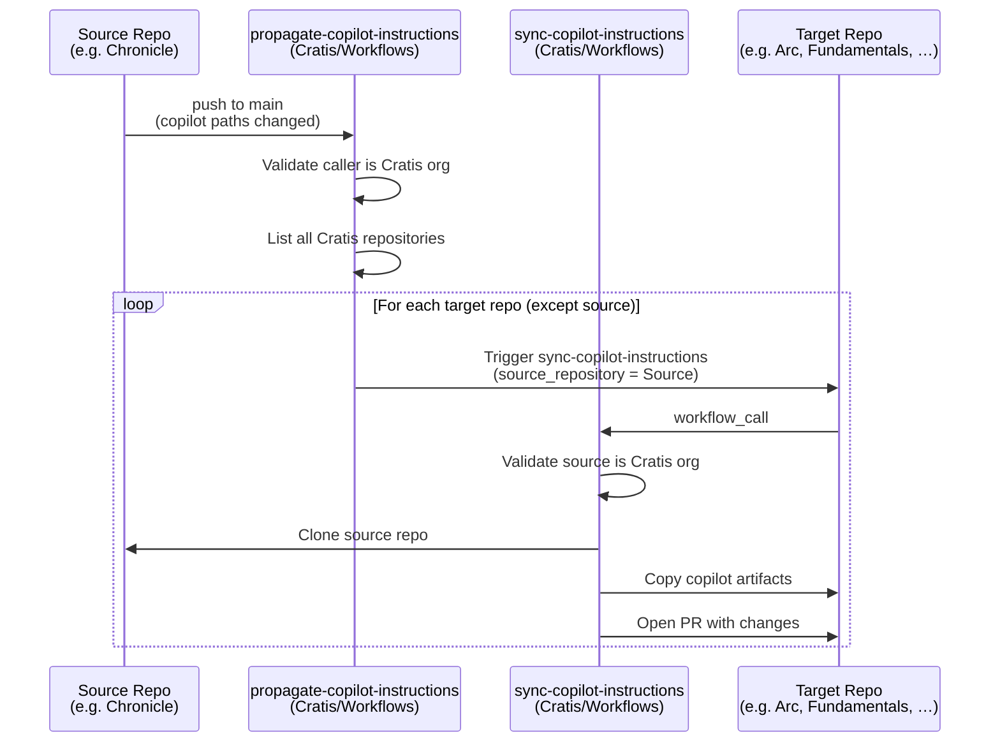
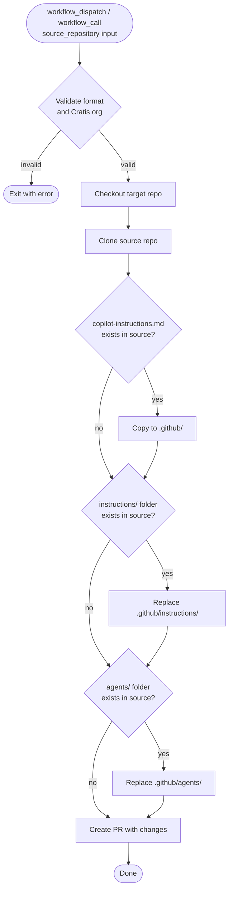

# Workflows

> [!IMPORTANT]
> This repository is for use by the **[Cratis](https://github.com/Cratis) organization only**. The reusable workflows here are designed specifically for the Cratis GitHub organization and include runtime validation that rejects calls from outside it.

Common reusable GitHub Actions workflows for Cratis repositories.

## Getting started with your Cratis repository

To connect a Cratis repository to the shared Copilot synchronization system, add two thin wrapper workflows to your repository. The easiest way is to trigger the [Bootstrap Copilot Sync](#bootstrap-copilot-sync-one-time-setup) workflow once — it will open a PR in every Cratis repository automatically.

If you prefer to add the workflows manually, create the following two files:

**`.github/workflows/sync-copilot-instructions.yml`**

```yaml
name: Sync Copilot Instructions

on:
  workflow_dispatch:
    inputs:
      source_repository:
        description: 'Source repository (owner/repo format)'
        required: true
        type: string

jobs:
  sync:
    uses: Cratis/Workflows/.github/workflows/sync-copilot-instructions.yml@main
    with:
      source_repository: ${{ inputs.source_repository }}
    secrets: inherit
```

**`.github/workflows/propagate-copilot-instructions.yml`**

```yaml
name: Propagate Copilot Instructions

on:
  push:
    branches: ["main"]
    paths:
      - ".github/copilot-instructions.md"
      - ".github/instructions/**"
      - ".github/agents/**"
      - ".github/skills/**"
      - ".github/prompts/**"
  workflow_dispatch:

jobs:
  propagate:
    uses: Cratis/Workflows/.github/workflows/propagate-copilot-instructions.yml@main
    with:
      event_name: ${{ github.event_name }}
    secrets: inherit
```

Both workflows require the `PAT_DOCUMENTATION` secret to be set in the repository or inherited from the organization.

| PAT type | Required permissions |
|---|---|
| Classic PAT | `repo` scope (full repository access) |
| Fine-grained PAT | **Contents** (read/write) + **Pull requests** (read/write) + **Metadata** (read) |

> [!IMPORTANT]
> If `PAT_DOCUMENTATION` is a fine-grained PAT you **must** grant **Pull requests: Read and write** in addition to Contents. Without it the bootstrap and sync workflows will be able to create branches but will fail to open pull requests, leaving orphan branches behind.

---

## How it works

### Copilot instruction synchronization

Copilot artifacts are kept in one authoritative repository and automatically propagated to all other Cratis repositories whenever they change.

The artifacts that are synchronized are:

| Path | Description |
|---|---|
| `.github/copilot-instructions.md` | Root Copilot instructions file |
| `.github/instructions/` | Folder of scoped instruction files |
| `.github/agents/` | Folder of custom agent definitions |
| `.github/skills/` | Folder of skill files |
| `.github/prompts/` | Folder of prompt files |

### Excluding files from synchronization

If a repository contains Copilot artifacts that are specific to that repository and should **not** be synced to other repos, create a `.github/.copilot-sync-ignore` file in the source repository. It works like a `.gitignore` — list one glob pattern per line.

```text
# Skills that are specific to this repository
skills/repo-specific-skill.md

# A whole subfolder of instructions
instructions/local-only/

# Wildcard examples
skills/experimental-*
prompts/draft-?.md
```

**Rules:**

| Feature | Syntax |
|---|---|
| Comment | Lines starting with `#` |
| Single-segment wildcard | `*` — matches any characters except `/` |
| Multi-segment wildcard | `**` — matches across directory boundaries |
| Single-character wildcard | `?` — matches exactly one character |
| `.github/` prefix | Optional — `skills/foo.md` and `.github/skills/foo.md` are equivalent |

When the sync or propagate workflow encounters this file in the source repository, any matching Copilot files are excluded before the PR is created in the target repository.

### Propagation flow

When Copilot instruction files are pushed to `main` in any Cratis repository:



### Sync workflow detail



---

## Workflows in this repository

### `sync-copilot-instructions.yml`

**Trigger:** `workflow_call` (invoked by each target repository)

Clones the `source_repository`, extracts the Copilot artifacts, and opens a pull request in the calling repository with the synchronized changes.

**Inputs:**

| Input | Required | Description |
|---|---|---|
| `source_repository` | ✅ | Source repository in `owner/repo` format. Must belong to the Cratis organization. |

**Secrets required:** `PAT_DOCUMENTATION` — classic PAT with `repo` scope, or fine-grained PAT with **Contents** + **Pull requests** read/write

**Trigger:** `workflow_call` (invoked by the source repository on push to `main`)

Lists all repositories in the Cratis organization and triggers `sync-copilot-instructions.yml` in each one (except the caller). Silently skips repositories where the workflow file does not exist.

**Validation:** Exits early if the calling repository does not belong to the `Cratis` organization.

**Secrets required:** `PAT_DOCUMENTATION` — classic PAT with `repo` scope, or fine-grained PAT with **Contents** + **Pull requests** read/write

---

### `bootstrap-copilot-sync.yml`

**Trigger:** `workflow_dispatch` (run once, manually)

One-time setup workflow. For every non-archived repository in the Cratis organization (except `Workflows` itself), it:

1. Creates a branch `add-copilot-sync-workflows`
2. Commits the two thin wrapper workflows shown in [Getting started](#getting-started-with-your-cratis-repository)
3. Opens a pull request targeting the repository's default branch

Re-running the workflow is safe — it skips repositories where the PR branch already exists.

**Secrets required:** `PAT_WORKFLOWS` — classic PAT with `repo` + `workflow` scopes, or fine-grained PAT with **Contents** + **Pull requests** + **Workflows** read/write

---

### `update-synced-workflows.yml`

**Trigger:** `workflow_dispatch` (run manually when wrapper workflow templates change)

Propagates the latest wrapper workflow files to all Cratis repositories. Run this workflow whenever the installed wrapper templates in this repository change (for example, when a new trigger or input is added).

For each non-archived repository (except `Workflows` itself), it:

1. Skips repositories where both wrapper files already match the latest version.
2. Skips repositories where neither wrapper file is present (not yet bootstrapped — run `bootstrap-copilot-sync.yml` first).
3. Creates or force-updates a branch `update-synced-workflows` with a commit that updates the two wrapper workflow files.
4. Opens a pull request targeting the repository's default branch.

**Secrets required:** `PAT_WORKFLOWS` — classic PAT with `repo` + `workflow` scopes, or fine-grained PAT with **Contents** + **Pull requests** + **Workflows** read/write

---

### `cleanup-copilot-sync-branches.yml`

**Trigger:** `workflow_dispatch` (run manually when needed)

Utility workflow that deletes the `add-copilot-sync-workflows` branch (or any branch name you specify via the `branch` input) from every non-archived Cratis repository where it exists.  It automatically skips repositories where an open pull request still references the branch.

Use this workflow to clean up orphan branches left behind by a partial or failed run of `bootstrap-copilot-sync.yml`.

**Inputs:**

| Input | Required | Default | Description |
|---|---|---|---|
| `branch` | No | `add-copilot-sync-workflows` | Name of the branch to delete across all repositories |

**Secrets required:** `PAT_DOCUMENTATION` — classic PAT with `repo` scope, or fine-grained PAT with **Contents** read/write
