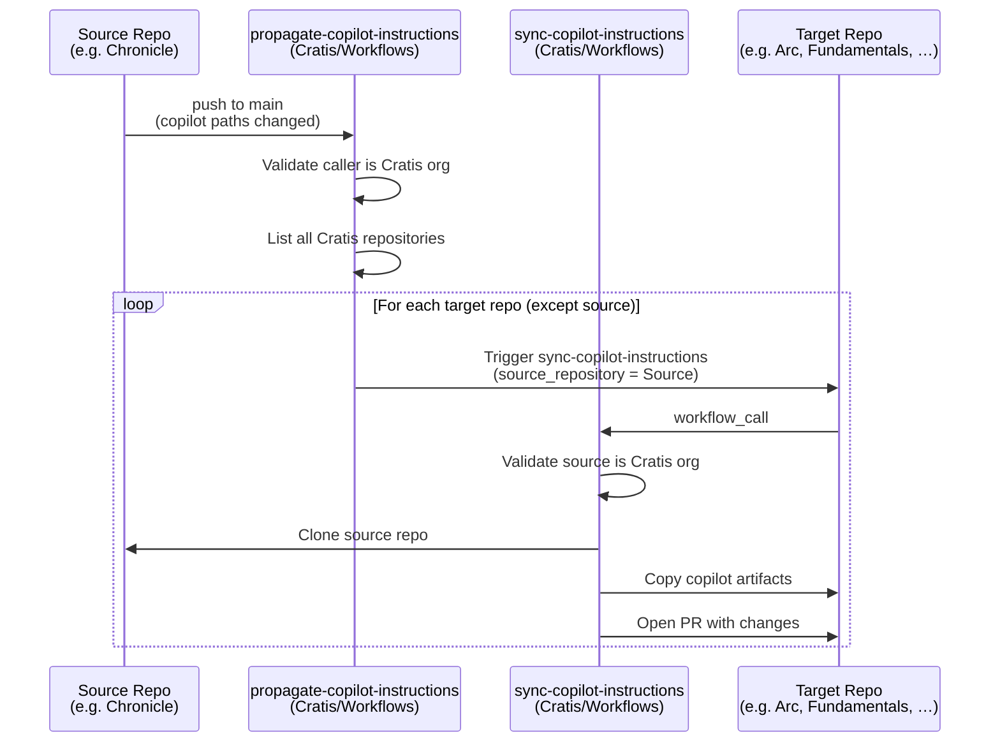

# Workflows

> [!IMPORTANT]
> This repository is for use by the **[Cratis](https://github.com/Cratis) organization only**. The reusable workflows here are designed specifically for the Cratis GitHub organization and include runtime validation that rejects calls from outside it.

Common reusable GitHub Actions workflows for Cratis repositories.

## Getting started with your Cratis repository

To connect a Cratis repository to the shared Copilot synchronization system, add two thin wrapper workflows to your repository. The easiest way is to trigger the [Bootstrap Copilot Sync](#bootstrap-copilot-sync-one-time-setup) workflow once — it will open a PR in every Cratis repository automatically.

If you prefer to add the workflows manually, create the following two files:

**`.github/workflows/sync-copilot-instructions.yml`**

```yaml
name: Sync Copilot Instructions

on:
  workflow_dispatch:
    inputs:
      source_repository:
        description: 'Source repository (owner/repo format)'
        required: true
        type: string

jobs:
  sync:
    uses: Cratis/Workflows/.github/workflows/sync-copilot-instructions.yml@main
    with:
      source_repository: ${{ inputs.source_repository }}
    secrets: inherit
```

**`.github/workflows/propagate-copilot-instructions.yml`**

```yaml
name: Propagate Copilot Instructions

on:
  push:
    branches: ["main"]
    paths:
      - ".github/copilot-instructions.md"
      - ".github/instructions/**"
      - ".github/agents/**"

jobs:
  propagate:
    uses: Cratis/Workflows/.github/workflows/propagate-copilot-instructions.yml@main
    secrets: inherit
```

Both workflows require the `PAT_DOCUMENTATION` secret (a GitHub Personal Access Token with `repo` scope) to be set in the repository or inherited from the organization.

---

## How it works

### Copilot instruction synchronization

Copilot artifacts are kept in one authoritative repository and automatically propagated to all other Cratis repositories whenever they change.

The artifacts that are synchronized are:

| Path | Description |
|---|---|
| `.github/copilot-instructions.md` | Root Copilot instructions file |
| `.github/instructions/` | Folder of scoped instruction files |
| `.github/agents/` | Folder of custom agent definitions |

### Propagation flow

When Copilot instruction files are pushed to `main` in any Cratis repository:



### Sync workflow detail


---

## Workflows in this repository

### `sync-copilot-instructions.yml`

**Trigger:** `workflow_call` (invoked by each target repository)

Clones the `source_repository`, extracts the Copilot artifacts, and opens a pull request in the calling repository with the synchronized changes.

**Inputs:**

| Input | Required | Description |
|---|---|---|
| `source_repository` | ✅ | Source repository in `owner/repo` format. Must belong to the Cratis organization. |

**Secrets required:** `PAT_DOCUMENTATION` (`repo` scope)

---

### `propagate-copilot-instructions.yml`

**Trigger:** `workflow_call` (invoked by the source repository on push to `main`)

Lists all repositories in the Cratis organization and triggers `sync-copilot-instructions.yml` in each one (except the caller). Silently skips repositories where the workflow file does not exist.

**Validation:** Exits early if the calling repository does not belong to the `Cratis` organization.

**Secrets required:** `PAT_DOCUMENTATION` (`repo` scope)

---

### `bootstrap-copilot-sync.yml`

**Trigger:** `workflow_dispatch` (run once, manually)

One-time setup workflow. For every non-archived repository in the Cratis organization (except `Workflows` itself), it:

1. Creates a branch `add-copilot-sync-workflows`
2. Commits the two thin wrapper workflows shown in [Getting started](#getting-started-with-your-cratis-repository)
3. Opens a pull request targeting the repository's default branch

Re-running the workflow is safe — it skips repositories where the PR branch already exists.

**Secrets required:** `PAT_DOCUMENTATION` (`repo` scope)
