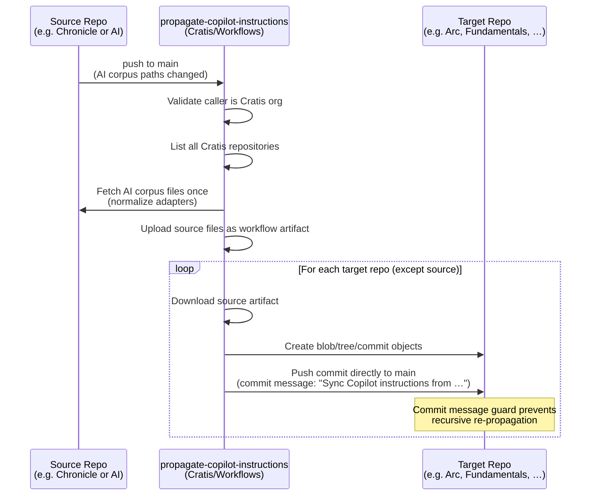
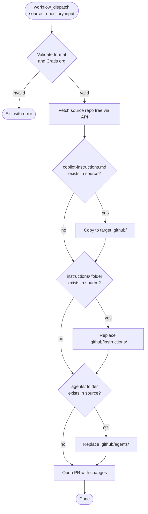

# Workflows

> [!IMPORTANT]
> This repository is for use by the **[Cratis](https://github.com/Cratis) organization only**. The reusable workflows here are designed specifically for the Cratis GitHub organization and include runtime validation that rejects calls from outside it.

Common reusable GitHub Actions workflows for Cratis repositories.

## Reviewed Cratis AI profile updates

`Update Cratis AI Profile Subscription` prepares normal pull requests for
repositories that explicitly subscribe through `.cratis/ai.json`. It replaces
fleet corpus copying with exact package-version updates; it never auto-merges or
changes project context.

The controller:

- accepts only an immutable `Cratis/AI.Distribution` release manifest URL and
  matching SHA-256;
- verifies profile, public/engineering channel, package name, and exact SemVer;
- performs a dry run unless `apply` and an exact repository confirmation are
  both supplied;
- changes only `.cratis/ai.json` and the matching exact Pi package source in
  `.pi/settings.json`;
- preserves Pi skill filters and unrelated settings;
- rejects partial APM-managed updates until their lockfile can be refreshed;
- supports explicit rollback to a lower exact release;
- scopes the GitHub App token to one authorized repository; and
- opens a normal PR whose repository checks must pass before a human merges it.

Run the controller locally without GitHub writes:

```bash
node .github/scripts/update-ai-profile-subscription.mjs \
  --repository /path/to/subscriber \
  --release-manifest /path/to/release-manifest.json
```

Add `--apply` only in a disposable/local checkout. The hosted workflow owns
branch and PR creation. Its one-time GitHub App installation scope and first
canary repositories remain tracked in Cratis/Workflows#72 and #73.

## Getting started with your Cratis repository

To connect a Cratis repository to the shared Copilot synchronization system, add two thin wrapper workflows to your repository. The easiest way is to trigger [Bootstrap Copilot Sync](#bootstrap-copilot-syncyml), which installs or refreshes the wrappers and corpus files directly on each repository's default branch.

If you prefer to add the workflows manually, create the following two files:

**`.github/workflows/sync-copilot-instructions.yml`**

```yaml
name: Sync Copilot Instructions

on:
  workflow_dispatch:
    inputs:
      source_repository:
        description: 'Source repository (owner/repo format)'
        required: true
        type: string

jobs:
  sync:
    uses: Cratis/Workflows/.github/workflows/sync-copilot-instructions.yml@main
    with:
      source_repository: ${{ inputs.source_repository }}
    secrets: inherit
```

**`.github/workflows/propagate-copilot-instructions.yml`**

```yaml
name: Propagate Copilot Instructions

on:
  push:
    branches: ["main"]
    paths:
      - ".ai/**"
      - ".claude/**"
      - ".agents/**"
      - "AGENTS.md"
      - ".github/copilot-instructions.md"
      - ".github/instructions/**"
      - ".github/agents/**"
      - ".github/skills"
      - ".github/skills/**"
      - ".github/prompts"
      - ".github/prompts/**"
      - ".github/hooks/**"
  workflow_dispatch:

jobs:
  propagate:
    uses: Cratis/Workflows/.github/workflows/propagate-copilot-instructions.yml@main
    with:
      event_name: ${{ github.event_name }}
    secrets: inherit
```

Both wrapper workflows require the `PAT_WORKFLOWS` secret to be set in the repository or inherited from the organization.

| PAT type | Required permissions |
|---|---|
| Classic PAT | `repo` scope (full repository access) |
| Fine-grained PAT | **Contents** (read/write) + **Metadata** (read) |

> [!IMPORTANT]
> The propagation workflow pushes directly to the default branch of each target repository. The GitHub user account that owns `PAT_WORKFLOWS` must therefore be configured as a **bypass actor** on every target repository's branch protection ruleset. See [Branch protection setup](#branch-protection-setup) below for the exact steps.

---

## Cleaning up PR artifacts

When a repository publishes Docker images or NuGet packages during pull requests (for example, pre-release builds tagged with the PR number), those packages should be removed once the pull request is closed to avoid accumulating stale artifacts.

### Automatic setup (recommended)

The easiest way is to trigger the [Bootstrap Cleanup PR Artifacts](#bootstrap-cleanup-pr-artifacts) workflow once — it will open a PR in every Cratis repository automatically, adding the wrapper workflow shown below.

### Manual setup

If you prefer to add the wrapper manually, create the following file in your repository:

**`.github/workflows/cleanup-pr-artifacts.yml`**

```yaml
name: Cleanup PR Artifacts

on:
  pull_request:
    types: [closed]

jobs:
  cleanup:
    uses: Cratis/Workflows/.github/workflows/cleanup-pr-artifacts.yml@main
    with:
      pull_request: ${{ github.event.pull_request.number }}
    secrets: inherit
```

The workflow assumes packages are tagged or versioned using the PR number:

| Package type | Expected pattern | Example |
|---|---|---|
| Container image (Docker) | tag contains `pr{number}` | `pr42` |
| NuGet package | version contains `pr{number}` | `1.0.0-pr42.1` |

Only packages linked to the calling repository are considered, so the cleanup is always scoped to the repository that called the workflow.

**Secrets required:** `PAT_WORKFLOWS` — classic PAT with `read:packages` + `delete:packages` scopes, or fine-grained PAT with **Packages** read/write

---

## Auto-approving publish deployments

For repositories using trusted publishing with npm and NuGet environments, the `auto-approve-publish-deployments` workflow automatically approves pending `npm` and `nuget` environment deployments when a publish workflow completes.

This workflow is distributed to all Cratis repositories via the common bootstrap process. It runs automatically whenever the `Publish` workflow finishes — no additional configuration is needed.

### How it works

1. When a `Publish` workflow completes (whether successful or not)
2. The `Auto-Approve Publish Deployments` workflow is triggered
3. It waits up to 30 minutes for pending npm/nuget deployments to appear
4. Any pending deployments to `npm` or `nuget` environments are automatically approved
5. Publishing proceeds without manual intervention

### Distributed via bootstrap

This workflow is included in the common workflow bootstrap process and is automatically propagated to all Cratis repositories alongside other default workflows.

> [!NOTE]
> See [publish.template.yml](/.github/workflows/publish.template.yml) for an example of a publish workflow that this auto-approve workflow will watch.

---

## Shared CodeQL configuration

The common workflow bootstrap also propagates **`.github/codeql/codeql-config.yml`** to repositories. The shared config currently excludes rule `ca1031`.

---

## How it works

### Copilot instruction synchronization

Copilot and AI-assistant artifacts are broadcast between Cratis repositories whenever they change.

The artifacts that are synchronized are:

| Path | Description |
|---|---|
| `.github/copilot-instructions.md` | Root Copilot instructions file |
| `.github/instructions/` | Folder of scoped instruction files |
| `.github/agents/` | Folder of custom agent definitions |
| `.github/skills/` | Folder of skill files |
| `.github/prompts/` | Folder of prompt files |
| `.github/hooks/` | Folder of hook files |
| `.ai/` | AI setup folder (including prompts, skills, agents, hooks, and rules) |
| `.claude/` | Claude setup folder (including symlinks such as `.claude/* -> .ai/*`) |
| `.agents/` | Codex adapter folder (except `.agents/PROJECT.md` — see below) |
| `AGENTS.md` | Root Codex instructions file |

**`.agents/PROJECT.md` is never synchronized.** It is each repository's *project-local* instruction
file — the one place a repo records what is true only of itself: its endpoints, credentials,
deployment recipes, issue tracker, and any convention that overrides the shared corpus for that repo
alone. Propagating it means whichever repository pushes last overwrites every other repository's
context, which is exactly what happened repeatedly before it was excluded here. The exclusion is
unconditional and lives in the propagation scripts rather than in each repository's
`.copilot-sync-ignore`, because that file only protects the repository it lives in — one repo
without one is enough to clobber all the others. It is also excluded from cleanup, so bootstrap
never deletes it.

Adapters are normalized and propagated as adapters. When a matching canonical `.ai` file exists in the source tree, known adapter paths are written as symlinks or path-reference files, even if the source repository currently contains copied content at that adapter path. This keeps `.ai/` as the synchronized source of truth instead of duplicating `.ai` content into tool-specific files.

### Excluding files from synchronization

If a repository contains Copilot artifacts that are specific to that repository and should **not** be synced to other repos, create a `.github/.copilot-sync-ignore` file in the source repository. It works like a `.gitignore` — list one glob pattern per line.

```text
# Skills that are specific to this repository
skills/repo-specific-skill.md

# A whole subfolder of instructions
instructions/local-only/

# Wildcard examples
skills/experimental-*
prompts/draft-?.md
```

**Rules:**

| Feature | Syntax |
|---|---|
| Comment | Lines starting with `#` |
| Single-segment wildcard | `*` — matches any characters except `/` |
| Multi-segment wildcard | `**` — matches across directory boundaries |
| Single-character wildcard | `?` — matches exactly one character |
| `.github/` prefix | Optional — `skills/foo.md` and `.github/skills/foo.md` are equivalent |

When the `.copilot-sync-ignore` file is present in the source repository, any matching Copilot files are excluded before the changes are pushed to the target repository.

### Propagation flow

When AI corpus files are pushed to `main` in any Cratis repository:


```mermaid
sequenceDiagram
    participant Source as Source Repo<br/>(e.g. Chronicle or AI)
    participant Propagate as propagate-copilot-instructions<br/>(Cratis/Workflows)
    participant Target as Target Repo<br/>(e.g. Arc, Fundamentals, …)

    Source->>Propagate: push to main<br/>(AI corpus paths changed)
    Propagate->>Propagate: Validate caller is Cratis org
    Propagate->>Propagate: List all Cratis repositories
    Propagate->>Source: Fetch AI corpus files once<br/>(normalize adapters)
    Propagate->>Propagate: Upload source files as workflow artifact
    loop For each target repo (except source)
        Propagate->>Propagate: Download source artifact
        Propagate->>Target: Create blob/tree/commit objects
        Propagate->>Target: Push commit directly to main<br/>(commit message: "Sync Copilot instructions from …")
        Note over Target: Commit message guard prevents<br/>recursive re-propagation
    end
```

**Anti-loop guard:** the propagated commit message starts with `Sync Copilot instructions from`, which the propagation workflow detects on the next push event and skips — preventing a recursive trigger chain.

### Sync workflow detail


```mermaid
flowchart TD
    A([workflow_dispatch\nsource_repository input]) --> B{Validate format\nand Cratis org}
    B -- invalid --> Z([Exit with error])
    B -- valid --> C[Fetch source repo tree via API]
    C --> D{copilot-instructions.md\nexists in source?}
    D -- yes --> E[Copy to target .github/]
    D -- no --> F
    E --> F{instructions/ folder\nexists in source?}
    F -- yes --> G[Replace .github/instructions/]
    F -- no --> H
    G --> H{agents/ folder\nexists in source?}
    H -- yes --> I[Replace .github/agents/]
    H -- no --> J
    I --> J[Open PR with changes]
    J --> K([Done])
```

### Temporarily freezing and restoring propagation

Use [`.github/scripts/ai-corpus-propagation-control.sh`](.github/scripts/ai-corpus-propagation-control.sh)
to pause the AI corpus distribution system without editing workflow files or
pushing commits. The script requires Bash, `gh`, and `jq`. It reads every active
organization repository and paginates workflow and run results before planning any
mutation.

All mutating operations dry-run unless both `--apply` and an exact organization
confirmation are supplied. An applied freeze also requires a new snapshot path:

```bash
# Read-only inspection and a strict frozen-state check.
.github/scripts/ai-corpus-propagation-control.sh status
.github/scripts/ai-corpus-propagation-control.sh verify-frozen

# Preview a freeze. This does not write the snapshot or call a mutating API.
.github/scripts/ai-corpus-propagation-control.sh freeze \
  --snapshot /secure/path/ai-corpus-snapshot.json

# Apply a freeze. The snapshot is written before the first API mutation.
.github/scripts/ai-corpus-propagation-control.sh freeze \
  --snapshot /secure/path/ai-corpus-snapshot.json \
  --apply --confirm-organization Cratis

# Restore exactly the workflows recorded active before that freeze.
.github/scripts/ai-corpus-propagation-control.sh restore \
  --snapshot /secure/path/ai-corpus-snapshot.json
.github/scripts/ai-corpus-propagation-control.sh restore \
  --snapshot /secure/path/ai-corpus-snapshot.json \
  --apply --confirm-organization Cratis
```

Snapshots are versioned JSON inventories containing repository coverage, workflow
paths and IDs, and original states. Restore refuses malformed snapshots, a different
organization, repository/workflow topology drift, incompatible state drift, or
any queued/running controlled run. It enables only entries recorded as `active`;
workflows already inactive before the freeze remain untouched. Keep snapshots
access-controlled even though they contain no token.

Freeze disables central bootstrap first, then disables only currently active
controlled workflows, cancels queued/running bootstrap, propagation, and sync runs,
and polls until no controlled run remains. Cancellation is irreversible: restore
does not restart canceled runs, revert corpus files, or roll back a partially
completed propagation.

For a deliberate topology change, first preview and then apply a canary or the
single-source model:

```bash
# Enable only central sync plus one target sync wrapper, then dispatch one PR sync.
.github/scripts/ai-corpus-propagation-control.sh canary --repo Arc
.github/scripts/ai-corpus-propagation-control.sh canary --repo Arc \
  --apply --confirm-organization Cratis

# Enable manual sync wrappers and automatic propagation only from Cratis/AI.
.github/scripts/ai-corpus-propagation-control.sh enable-single-source
.github/scripts/ai-corpus-propagation-control.sh enable-single-source \
  --apply --confirm-organization Cratis
```

Both operations first disable and quiesce the complete controlled topology. The
legacy all-to-all topology is available only with two explicit confirmations:

```bash
.github/scripts/ai-corpus-propagation-control.sh enable-legacy-all-to-all \
  --confirm-legacy-all-to-all \
  --apply --confirm-organization Cratis
```

Prefer `canary` followed by `enable-single-source`; all-to-all allows a corpus
change in any repository to initiate organization-wide fan-out.

The same operations are available from the **AI Corpus Propagation Control**
manual workflow. `apply` defaults to `false`. Applied freezes upload a 90-day
`ai-corpus-propagation-snapshot` artifact; restore requires the freeze workflow run
ID and downloads that exact artifact. The current organization freeze predates this
snapshot mechanism, so it cannot be exactly reversed with `restore`; resume it only
through a reviewed canary/single-source plan or a separately verified snapshot.

The workflow executes only from `main`, checks out the protected `main` script, and
uses the `ai-corpus-propagation-control` GitHub Environment. Configure that
environment with required reviewers and a deployment-branch rule allowing only
`main` before adding `PAT_WORKFLOWS`. This environment protection is the security
boundary that prevents a branch-selected workflow from exposing the organization
PAT.

The token needs organization repository visibility and **Actions: read** for
`status`, `verify-frozen`, and dry-runs. Applied state changes and run cancellation
need **Actions: read/write** for every controlled repository. Canary and propagation
also need the Contents/Pull requests/Workflows permissions documented for their
respective reusable workflows.

Disabling a workflow through the Actions API persists across pushes until it is
explicitly enabled again. Existing corpus files remain in each repository; a
freeze neither reverts nor deletes already-synchronized content.

Run the offline validation suite without a GitHub token:

```bash
bash -n .github/scripts/*.sh .github/scripts/tests/*.sh
shellcheck -x .github/scripts/ai-corpus-propagation-control.sh \
  .github/scripts/github-api-retry.sh .github/scripts/tests/*.sh
actionlint .github/workflows/ai-corpus-propagation-control.yml
bash .github/scripts/tests/github-api-retry.test.sh
bash .github/scripts/tests/ai-corpus-propagation-control.test.sh
```

---

## Workflows in this repository

### `ai-corpus-propagation-control.yml`

**Trigger:** `workflow_dispatch`

Runs the status/verify/freeze/snapshot-restore/canary/topology script through a
guarded manual interface. Mutations require `apply` plus an exact `Cratis`
confirmation. Restoring a snapshot requires the freeze workflow run ID. Restoring
the legacy all-to-all topology additionally requires
`confirm_legacy_all_to_all`.

**Environment required:** protected `ai-corpus-propagation-control`, restricted to
`main` and configured with required reviewers.

**Secrets required:** `PAT_WORKFLOWS` with Actions read/write access in every
controlled repository and the extra permissions required by the selected
synchronization mode.

---

### `sync-copilot-instructions.yml`

**Trigger:** `workflow_call` (invoked by each target repository)

Fetches the Copilot artifacts from the `source_repository` via the GitHub API and opens a pull request in the calling repository with the synchronized changes.

**Inputs:**

| Input | Required | Description |
|---|---|---|
| `source_repository` | ✅ | Source repository in `owner/repo` format. Must belong to the Cratis organization. |

**Secrets required:** `PAT_WORKFLOWS` — classic PAT with `repo` scope, or fine-grained PAT with **Contents** + **Pull requests** read/write + **Metadata** read

---

### `propagate-copilot-instructions.yml`

**Trigger:** `workflow_call` (invoked by the source repository on push to `main`)

Lists all repositories in the Cratis organization and pushes the Copilot instruction files directly to the default branch of each one (except the caller). The source files are fetched once and reused from a workflow artifact while target repositories are processed with bounded parallelism. Silently skips repositories where files are already up to date.

**Anti-loop protection:** commits made by this workflow start with `Sync Copilot instructions from`, which the workflow detects on subsequent pushes and skips — preventing recursive propagation chains.

**Validation:** Exits early if the calling repository does not belong to the `Cratis` organization.

**Secrets required:** `PAT_WORKFLOWS` — classic PAT with `repo` scope, or fine-grained PAT with **Contents** read/write + **Metadata** read. The PAT owner must be a bypass actor on each target repository's branch protection ruleset.

---

### `bootstrap-copilot-sync.yml`

**Trigger:** `workflow_dispatch` (manual bootstrap and refresh)

This workflow is intentionally manual because it performs organization-wide writes and can consume a large GitHub REST API budget. Use it for planned bootstrap, wrapper rollout, or managed corpus refresh work, not as a merge-triggered check.

For every non-archived repository in the Cratis organization except `Workflows`, it:

1. Creates or updates the two thin wrapper workflows shown in [Getting started](#getting-started-with-your-cratis-repository).
2. Refreshes the managed Copilot corpus files from `Cratis/AI` and removes obsolete managed files.
3. Creates a non-force, fast-forward commit directly on the repository's default branch when content changed.
4. Skips repositories that are already up to date.

**Secrets required:** `PAT_WORKFLOWS` — classic PAT with `repo` + `workflow` scopes, or fine-grained PAT with **Contents** + **Workflows** read/write. The PAT owner must be a bypass actor for each target's default-branch protection.

---

### `update-synced-workflows.yml`

**Trigger:** `workflow_dispatch` (run manually when wrapper workflow templates change)

Propagates the latest wrapper workflow files to all Cratis repositories. Run this workflow whenever the installed wrapper templates in this repository change (for example, when a new trigger or input is added).

For each non-archived repository (except `Workflows` itself), it:

1. Skips repositories where both wrapper files already match the latest version.
2. Skips repositories where neither wrapper file is present (not yet bootstrapped — run `bootstrap-copilot-sync.yml` first).
3. Creates or force-updates a branch `update-synced-workflows` with a commit that updates the two wrapper workflow files.
4. Opens a pull request targeting the repository's default branch.

**Secrets required:** `PAT_WORKFLOWS` — classic PAT with `repo` + `workflow` scopes, or fine-grained PAT with **Contents** + **Pull requests** + **Workflows** read/write

---

### `cleanup-pr-artifacts.yml`

**Trigger:** `workflow_call` (invoked by any Cratis repository when a pull request is closed)

Deletes GitHub Packages — container images (Docker) and NuGet packages — that were published during a pull request. Only package versions linked to the calling repository that match the PR number pattern are deleted.

**Inputs:**

| Input | Required | Description |
|---|---|---|
| `pull_request` | ✅ | The pull request number whose artifacts should be deleted. |

**Expected naming conventions:**

| Package type | Pattern | Example |
|---|---|---|
| Container image (Docker) | tag contains `pr{number}` | `pr42` |
| NuGet package | version contains `pr{number}` | `1.0.0-pr42.1` |

**Secrets required:** `PAT_WORKFLOWS` — classic PAT with `read:packages` + `delete:packages` scopes, or fine-grained PAT with **Packages** read/write

---

### `bootstrap-cleanup-pr-artifacts.yml`

**Trigger:** `push` to `main` (when `cleanup-pr-artifacts.yml` or its script changes), or `workflow_dispatch`

Opens a pull request in every non-archived Cratis repository to add (or update) the cleanup-pr-artifacts wrapper workflow.  Re-running this workflow is safe — it is fully idempotent: repositories where the wrapper is already up-to-date are skipped, and any stale open PRs for repos that no longer need changes are automatically closed.

Repositories can be excluded from bootstrapping by adding their name to the `REPOS_TO_IGNORE` list in the workflow file.

**Secrets required:** `PAT_WORKFLOWS` — classic PAT with `repo` + `workflow` scopes, or fine-grained PAT with **Contents** + **Pull requests** + **Workflows** read/write
### `propagate-pr-templates.yml`

**Trigger:** `push` to `main` (when template files change) or `workflow_dispatch`

Propagates the Pull Request and Issue templates from this repository (`Cratis/Workflows`) directly to the default branch of every other non-archived Cratis repository. Silently skips repositories where files are already up to date.

**Excluded repositories:** `Workflows`, `cratis.github.io`, `StudioIssues` (same exceptions as `propagate-copilot-instructions.yml`).

**Secrets required:** `PAT_WORKFLOWS` — classic PAT with `repo` scope, or fine-grained PAT with **Contents** read/write + **Metadata** read. The PAT owner must be a bypass actor on each target repository's branch protection ruleset.

---

### `cleanup-copilot-sync-branches.yml`

**Trigger:** `workflow_dispatch` (run manually when needed)

Utility workflow that deletes the `add-copilot-sync-workflows` branch (or any branch name you specify via the `branch` input) from every non-archived Cratis repository where it exists.  It automatically skips repositories where an open pull request still references the branch.

Use this workflow to clean up orphan branches left behind by a partial or failed run of `bootstrap-copilot-sync.yml`.

**Inputs:**

| Input | Required | Default | Description |
|---|---|---|---|
| `branch` | No | `add-copilot-sync-workflows` | Name of the branch to delete across all repositories |

**Secrets required:** `PAT_DOCUMENTATION` — classic PAT with `repo` scope, or fine-grained PAT with **Contents** read/write

---

## Branch protection setup

Because `propagate-copilot-instructions.yml` pushes directly to each target repository's default branch, you must grant the PAT owner permission to bypass the normal branch protection rules. Use GitHub **Repository Rulesets** (not the legacy "Branch protection rules") so that you can add a precise bypass actor.

### Steps (repeat for every target repository)

1. Go to **Settings → Rules → Rulesets** in the target repository.
2. Click **New ruleset → New branch ruleset**.
3. Set **Target branches** to the default branch (e.g. `main`).
4. Enable the rule **Require a pull request before merging** (and any other rules you want, such as required status checks).
5. Under **Bypass list**, click **Add bypass** and add the GitHub user account that owns `PAT_WORKFLOWS`. Set the bypass role to **Always**.
6. Save the ruleset.

> [!TIP]
> If you manage many repositories you can create the ruleset at the **organization level** (Organization Settings → Rules → Rulesets), target all repositories, and add the bypass actor once.

### Path enforcement

The bypass actor can technically push any content to the default branch. The workflow enforces the path constraint in code — it only ever commits files under:

```
.github/copilot-instructions.md
.github/instructions/
.github/agents/
.github/skills/
.github/prompts/
.github/hooks/
.github/ISSUE_TEMPLATE/
.github/pull_request_template.md
```

For an extra layer of defence you can add a **Restrict file paths** rule to the ruleset that blocks direct changes to files *outside* these paths from all other actors. The bypass actor is exempt from this restriction, but since the bypass is scoped to a dedicated service account whose only use is this workflow, the effective risk is minimal.

### Choosing the PAT owner

Use a dedicated GitHub service-account (bot user) for `PAT_WORKFLOWS`, not a personal developer account. This makes the bypass list easy to audit and ensures the token is never accidentally shared with workflows that should not have direct-push access.

### Anti-loop protection

Every commit created by the propagation workflow uses the message:

```
Sync Copilot instructions from <owner>/<repo>
```

The `propagate-copilot-instructions.yml` workflow in each target repository detects this prefix on the next `push` event and exits without triggering another round of propagation, preventing recursive loops.
